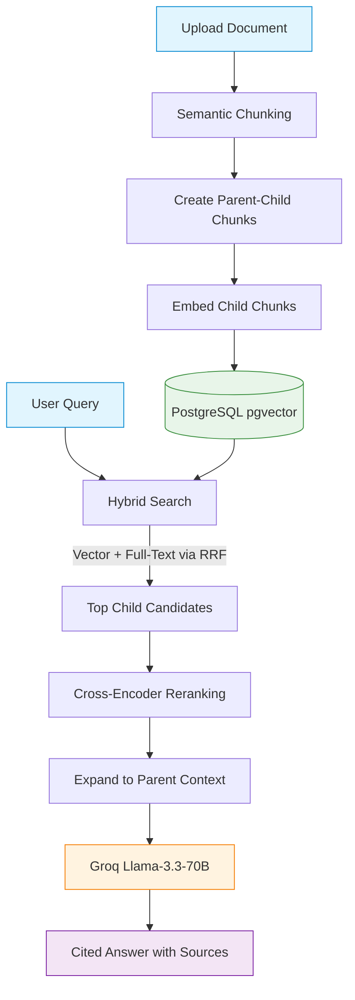

# AskMyDocs — AI-Powered Document Q&A

> Production-grade RAG system: **Semantic & Parent-Child Chunking** + **Hybrid Search** (pgvector + FTS) + **Cross-Encoder Reranking** + **Groq Llama-3.3** with citation enforcement.

---

## Architecture

```text
Frontend (React + Vite + TS)  →  Vercel
Backend  (FastAPI + Python)   →  Render (Docker)
Database (PostgreSQL + pgvector) → Neon.tech
```

**RAG Pipeline Visualization:**



---

## Quick Start

### Backend

```bash
# 1. Setup backend locally
cd backend
cp .env.example .env          # Fill in DATABASE_URL + GROQ_API_KEY
python -m venv .venv && source .venv/bin/activate

# macOS: plain torch (CPU-only by default — no +cpu suffix needed on macOS)
pip install torch
# Linux (CI / Docker): CPU-only build
# pip install torch==2.5.1+cpu --index-url https://download.pytorch.org/whl/cpu

pip install -r requirements.txt
alembic upgrade head           # Run database migrations
uvicorn app.main:app --reload
```

API docs available at: `http://localhost:8000/docs`

### Frontend

```bash
cd client
npm install
# Create .env.local with:
# VITE_API_BASE_URL=http://localhost:8000
npm run dev
```

Frontend available at: `http://localhost:5173`

---

## Environment Variables

### Backend (see `backend/.env.example`)

| Variable | Description |
|---|---|
| `DATABASE_URL` | Neon.tech asyncpg connection string |
| `GROQ_API_KEY` | Groq API secret |
| `EMBEDDING_MODEL` | Default: `BAAI/bge-small-en-v1.5` |
| `RERANKER_MODEL` | Default: `cross-encoder/ms-marco-MiniLM-L-6-v2` |
| `CORS_ORIGINS` | Your Vercel app URL |

### Frontend (Vercel Dashboard)

| Variable | Description |
|---|---|
| `VITE_API_BASE_URL` | Your Render backend URL |

---

## Deployment

### 1. Database (Neon.tech)
1. Create a free PostgreSQL project on [neon.tech](https://neon.tech)
2. Enable the `pgvector` extension: `CREATE EXTENSION IF NOT EXISTS vector;`
3. Copy the connection string → set as `DATABASE_URL`
4. Run migrations: `alembic upgrade head`

### 2. Backend (Render)
1. Push to GitHub
2. Create a new **Web Service** on [render.com](https://render.com)
3. Set **Environment**: Docker | **Dockerfile path**: `backend/Dockerfile`
4. Add all environment variables from `.env.example`
5. Set **Health Check Path**: `/health`

### 3. Frontend (Vercel)
1. Import the repo on [vercel.com](https://vercel.com)
2. Set **Root Directory**: `client`
3. Add environment variable: `VITE_API_BASE_URL=https://your-backend.onrender.com`
4. Deploy

### 4. CI/CD (GitHub Actions)
Add these secrets to your GitHub repository:
- `GROQ_API_KEY`
- `DATABASE_URL` (Neon test database)
- `GHCR_TOKEN` (GitHub Container Registry)

---

## API Reference

| Method | Endpoint | Description |
|--------|----------|-------------|
| `GET`  | `/health` | Liveness probe |
| `POST` | `/api/v1/ingest` | Upload PDF/TXT |
| `GET`  | `/api/v1/ingest/{job_id}` | Poll job status |
| `POST` | `/api/v1/query` | RAG Q&A |
| `GET`  | `/api/v1/docs` | List documents |
| `DELETE` | `/api/v1/docs/{doc_id}` | Delete document |

### Query Request
```json
{
  "question": "What are the main findings?",
  "doc_id": "optional-filter",
  "include_eval": false
}
```

### Query Response
```json
{
  "question": "What are the main findings?",
  "answer": "The main findings include [S1] and [S2].",
  "sources": [{"source_name": "report.pdf", "content": "...", "rerank_score": 0.94}],
  "latency_ms": 842.3,
  "eval_scores": null
}
```

---

## Project Structure

```
AskMyDocs/
├── backend/              # FastAPI + PostgreSQL RAG engine
│   ├── app/
│   │   ├── api/v1/       # Endpoints: ingest, query, health
│   │   ├── core/         # Config, logging, exceptions
│   │   ├── models/       # SQLAlchemy ORM (pgvector)
│   │   ├── schemas/      # Pydantic V2 schemas
│   │   ├── services/     # chunker, embedder, retriever, reranker, llm, rag_engine, evaluator
│   │   └── main.py       # FastAPI app factory
│   ├── tests/            # pytest + Ragas CI gate
│   └── Dockerfile        # Multi-stage, CPU-only torch, pre-baked models
├── client/               # React + Vite + TypeScript
│   └── src/
│       ├── api/          # Axios client
│       ├── components/   # ChatWindow, MessageBubble, UploadPanel, Sidebar
│       ├── hooks/        # useChat, useUpload
│       ├── pages/        # HomePage, ChatPage
│       └── store/        # Zustand global state
└── .github/workflows/
    └── ci-eval.yml       # lint → test → Ragas gate → Docker push
```

---

## Tech Stack

| Layer | Technology |
|---|---|
| Embeddings | `BAAI/bge-small-en-v1.5` (384-dim, local) |
| Reranker | `cross-encoder/ms-marco-MiniLM-L-6-v2` (local) |
| LLM | Groq Llama-3.3-70B |
| Chunking | Semantic Chunking + Parent-Child Context Expansion |
| Vector Search | pgvector (HNSW index, cosine similarity) |
| Keyword Search | PostgreSQL tsvector (GIN index) |
| Fusion | Reciprocal Rank Fusion (RRF, k=60) |
| Evaluation | Ragas (faithfulness, relevance, precision, recall) |
